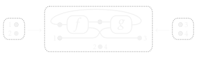

Hello! I'm George, a PhD student researcher at the University of Birmingham, under the supervision of [Dan Ghica](https://www.cs.bham.ac.uk/~drg/) and [Miriam Backens](https://www.cs.bham.ac.uk/~backensm/)!

I am a member of the [Theory Group](https://www.cs.bham.ac.uk/research/groupings/theory/).

## About me

I play the piano, enjoy train journeys and walks down canals, and (unfortunately) support Arsenal.

I'm also currently School of Computer Science [Cookie Break](https://www.cs.bham.ac.uk/internal/research_students/cookiebreaks/) admin!

I occasionally take photos of pretty things and put them on [Instagram](https://www.instagram.com/georgejkaye/).

Here are some [pictures](/pictures) of me!

## Interests

* Programming languages
* The lambda calculus
* Diagrams
* Compilers
* Reasoning

## Current work

{: style="text-align: center" }

Currently my work involves defining hypergraphs and showing that these hypergraphs can be used to model a traced symmetric monoidal category. Eventually this will lead to developing a sound and complete diagrammatic semantics for digital circuits.

## Projects

**Diagrammatic semantics for digital circuits** \[[Visualiser](\circuits\visualiser)\] \[[Very basic talk](\pages\circuits\Diagrammatic semantics for digital circuits.pdf)\]  
*Defining an operational semantics for digital circuits using hypergraphs.*

**A visualiser for linear lambda-terms as rooted 3-valent maps** \[[Page](\lambda-visualiser)\]  
*A set of tools for the representation of lambda terms as their corresponding rooted maps. Developed for my MSci final year project under the supervision of [Noam Zeilberger](http://noamz.org/).*

## Talks

**A visualiser for linear lambda-terms as rooted 3-valent maps**  
[CLA 2019](http://cla.tcs.uj.edu.pl/) *July 1-2, 2019* \[[Slides](/pages/lambda-visualiser/docs/CLA'2019 - A visualiser for linear lambda-terms as rooted 3-valent maps.pdf)\]

## Visits

* [**MGS Christmas Seminar**](https://staffwww.dcs.shef.ac.uk/people/G.Struth/mgs_xmas19.html) (December 18, 2019)
* [**SYCO 6, Leicester**](http://events.cs.bham.ac.uk/syco/6/) (December 16-17, 2019)
* [**CLA 2019, Versailles**](http://cla.tcs.uj.edu.pl/) (July 1-2, 2019)

## Teaching

### 2019-20

* **Spring 2020:** [Compilers & Languages](https://www.cs.bham.ac.uk/internal/modules/2019/06-02578/) \[[OCaml tutorial](/ocaml)\]
* **Autumn 2019:** [Mathematical Foundations of Computer Science](https://www.cs.bham.ac.uk/internal/modules/2019/06-30181/)

## Contact me

**Personal:** georgejkaye at gmail.com

**University:** g.j.kaye at cs.bham.ac.uk

**Where to find me:** ~~Office 244 (Desk J), School of Computer Science, University of Birmingham~~ My house, under lockdown!

## Misc

* [Train Simulator scenarios](/trains/scenarios)
